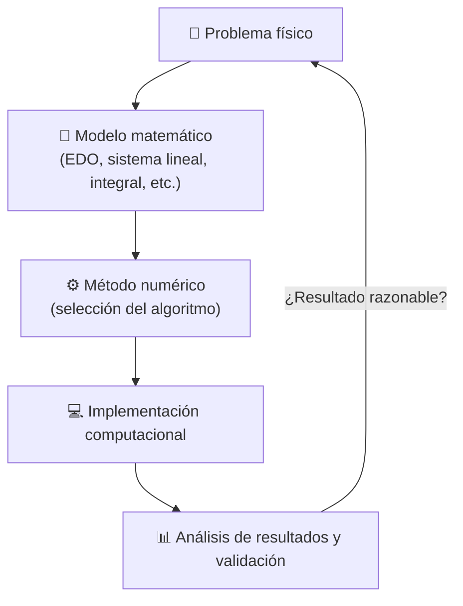

# Capítulo 1: Modelos Matemáticos y Solución de Problemas en Ingeniería

## ¿Qué es un modelo matemático?

Un **modelo matemático** es una representación funcional de un sistema o proceso físico que relaciona variables de estado con parámetros del sistema y variables independientes (como el espacio o el tiempo). En términos generales, se puede describir mediante una ecuación diferencial o un sistema de ecuaciones de la forma:

$$
\frac{d\mathbf{x}}{dt} = \mathbf{f}(\mathbf{x}(t), \mathbf{p}, t)
$$

donde:
- $\mathbf{x}(t) \in \mathbb{R}^n$ representa el vector de **variables de estado** (ej. velocidad, posición, temperatura).
- $\mathbf{p} \in \mathbb{R}^m$ representa el vector de **parámetros del sistema** (ej. constante de amortiguamiento, resistencia eléctrica, masa).
- $t$ es la variable independiente (**tiempo**).
- $\mathbf{f}$ es una función vectorial que describe la dinámica del sistema físico.

---

## Ciclo de solución de problemas de ingeniería

El proceso moderno de resolver problemas de ingeniería combinando modelos físicos, matemáticas aplicadas y programación se representa mediante el siguiente ciclo interactivo:

---

## Ejemplo motivador: caída libre con resistencia del aire

Para ilustrar este ciclo, consideremos la segunda ley de Newton ($F = m \cdot a$) aplicada a un cuerpo (como un paracaidista) en caída libre unidimensional sujeto a la gravedad y a una fuerza de arrastre viscoso que es proporcional a la velocidad:

$$
m \frac{dv}{dt} = m g - c v
$$

donde:
- $m$ es la masa del cuerpo ($\text{kg}$).
- $g \approx 9.81\,\text{m/s}^2$ es la aceleración debido a la gravedad.
- $c$ es el coeficiente de arrastre viscoso ($\text{kg/s}$).
- $v(t)$ es la velocidad descendente instantánea del cuerpo ($\text{m/s}$).

### Solución analítica (exacta)

Si el cuerpo parte del reposo ($v(0) = 0$), esta ecuación diferencial lineal de primer orden se puede resolver exactamente por separación de variables, obteniendo:

$$
v(t) = \frac{m g}{c} \left( 1 - e^{-\frac{c}{m} t} \right)
$$

La **velocidad terminal** ($v_{\infty}$) es la velocidad límite alcanzada cuando las fuerzas de gravedad y arrastre se equilibran perfectamente, es decir, cuando la aceleración del sistema se anula ($\frac{dv}{dt} = 0$):

$$
v_{\infty} = \lim_{t \to \infty} v(t) = \frac{m g}{c}
$$

### Solución numérica (método de Euler)

En la práctica, muchos modelos físicos son no lineales y carecen de una solución analítica exacta. Aquí es donde los métodos numéricos son indispensables. 

Aproximando la derivada temporal mediante un esquema de diferencias finitas divididas hacia adelante (el método de Euler):

$$
\frac{dv}{dt} \approx \frac{v(t_{i+1}) - v(t_i)}{\Delta t}
$$

Sustituyendo esto en nuestra ecuación diferencial, obtenemos la relación de recurrencia numérica:

$$
v(t_{i+1}) = v(t_i) + \underbrace{\left( g - \frac{c}{m} v(t_i) \right)}_{\text{Pendiente local } f(v_i, t_i)} \Delta t
$$

donde $\Delta t = t_{i+1} - t_i$ representa el tamaño del paso temporal.

### Comparación numérica vs. analítica ($m = 68.1\,\text{kg}$, $c = 12.5\,\text{kg/s}$)

Al simular la velocidad usando un paso de tiempo $\Delta t = 2\,\text{s}$ partiendo de la condición inicial $v(0) = 0\,\text{m/s}$, se observan los siguientes resultados:

| $t$ ($\text{s}$) | $v(t)$ analítica ($\text{m/s}$) | $v_i$ Euler ($\Delta t = 2\,\text{s}$) ($\text{m/s}$) | $\varepsilon_t$ (\%) |
| :---: | :---: | :---: | :---: |
| 0 | 0.000 | 0.000 | — |
| 2 | 16.405 | 19.620 | 19.6 % |
| 4 | 27.768 | 32.464 | 16.9 % |
| 10 | 44.872 | 47.174 | 5.1 % |
| $\infty$ | 53.393 | 53.393 | 0.0 % |

El error relativo porcentual verdadero ($\varepsilon_t$) se reduce sustancialmente si disminuimos el tamaño del paso $\Delta t$. Además, en el límite asintótico $t \to \infty$, la velocidad numérica converge exactamente al mismo límite físico (velocidad terminal), ya que en ese punto la derivada es cero y el sistema se encuentra en estado estacionario.

---

## Clasificación de modelos y métodos

Los problemas matemáticos de la ingeniería física se clasifican en categorías bien definidas. Cada una de ellas exige una clase particular de algoritmo numérico:

| Formulación Matemática | Tipo de Problema | Método Numérico Principal |
| :--- | :--- | :--- |
| $f(x) = 0$ | Búsqueda de raíces de ecuaciones no lineales | Métodos de bisección, secante y Newton-Raphson (Caps. 5–7) |
| $\mathbf{A}\mathbf{x} = \mathbf{b}$ | Sistemas de ecuaciones lineales algebraicas | Eliminación gaussiana, descomposición LU y Gauss-Seidel (Caps. 9–11) |
| $\min f(\mathbf{x})$ o $\max f(\mathbf{x})$ | Optimización multidimensional | Métodos de búsqueda áurea, gradiente conjugado (Caps. 13, 15) |
| $y \approx f(x)$ o $P_n(x)$ | Ajuste de curvas e interpolación | Regresión por mínimos cuadrados, splines cúbicos (Caps. 17–18) |
| $I = \int_{a}^{b} f(x)\,dx$ | Integración y diferenciación numérica | Fórmulas de Newton-Cotes (Trapecio, Simpson) (Caps. 21–22) |
| $\frac{dy}{dx} = f(x, y)$ | Ecuaciones Diferenciales Ordinarias (EDO) | Métodos de Euler, Runge-Kutta de diversos órdenes (Caps. 25, 27) |
| $\alpha \frac{\partial^2 u}{\partial x^2} = \frac{\partial u}{\partial t}$ | Ecuaciones Diferenciales Parciales (EDP) | Esquemas de diferencias finitas y elementos finitos (Caps. 30–31) |

---

## Conservación como principio unificador

El principio fundamental que unifica la formulación de modelos matemáticos en ingeniería es la **ley de conservación**. Matemáticamente, se expresa sobre un volumen de control como:

$$
\underbrace{\frac{d\Phi}{dt}}_{\text{Tasa de acumulación}} = \underbrace{\dot{\Phi}_{\text{entrada}} - \dot{\Phi}_{\text{salida}}}_{\text{Flujo neto de transporte}} + \underbrace{\dot{S}_{\text{generación}}}_{\text{Fuentes o sumideros}}
$$

donde:
- $\Phi$ es la propiedad física conservada (ej. masa, energía térmica, momento lineal).
- $\dot{\Phi}_{\text{entrada}}$ y $\dot{\Phi}_{\text{salida}}$ son las tasas de flujo de la propiedad que cruzan las fronteras del sistema.
- $\dot{S}_{\text{generación}}$ representa la tasa neta a la cual la propiedad se produce o consume dentro del volumen de control.

### Ejemplos fundamentales en ingeniería:
- **Conservación de la Energía**: Leyes de termodinámica y transferencia de calor. Da lugar a la ecuación del calor y ecuaciones parabólicas/elípticas (Cap. 30).
- **Conservación de la Masa**: Ecuación de continuidad en dinámica de fluidos. Es el pilar de los modelos de transporte y flujo (Cap. 31).
- **Conservación de la Cantidad de Movimiento**: Segunda ley de Newton aplicada a fluidos (ecuaciones de Navier-Stokes) o sólidos. Se traduce en sistemas acoplados de EDOs y álgebra lineal (Caps. 9 y 25).

:::tip Para recordar
La estructura física del modelo matemático **determina directamente** qué familia de métodos numéricos debes aplicar. Identificar la ecuación rectora representa el 50% de la solución del problema.
:::
