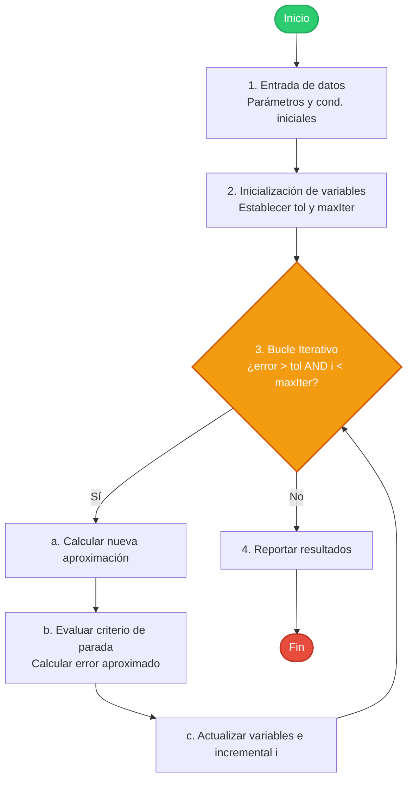

# Capítulo 2: Programación y Software en Métodos Numéricos

## Herramientas computacionales

La implementación de métodos numéricos requiere de entornos computacionales eficientes y lenguajes optimizados para el cálculo científico. A continuación, se clasifican las herramientas más utilizadas en la ingeniería actual:

| Entorno / Lenguaje | Fortaleza Principal | Casos de Uso Recomendados |
| :--- | :--- | :--- |
| **MATLAB / Octave** | Álgebra lineal matricial nativa, visualización integrada y prototipado rápido. | Laboratorios académicos, sistemas de control, procesamiento de señales. |
| **Python (NumPy / SciPy)** | Ecosistema general amplio, integración sencilla con Inteligencia Artificial y Ciencia de Datos. | Análisis de datos masivos, machine learning, simulaciones acopladas. |
| **Julia** | Resuelve el "problema de los dos lenguajes": ofrece la velocidad de C con sintaxis de alto nivel. | Cómputo científico de alto rendimiento, optimización matemática compleja. |
| **C / C++ / Fortran** | Control absoluto de la memoria y máxima eficiencia de cómputo en la CPU/GPU. | Solucionadores comerciales de CFD (dinámica de fluidos), motores de física y FEA. |

---

## Estructura fundamental de un programa numérico

Un programa numérico robusto debe ser modular y estar diseñado para evitar bucles infinitos, controlando en todo momento los errores de redondeo. La arquitectura típica del flujo lógico es la siguiente:



### Implementación en pseudocódigo limpio (Pythonico)

El siguiente código esquematiza la estructura genérica para implementar cualquier método iterativo bajo criterios de seguridad industrial:

```python
def metodo_iterativo(f, x0, tol=1e-6, max_iter=100):
    """
    Estructura genérica de un algoritmo iterativo numérico.
    
    Parámetros:
        f        : Función objetivo
        x0       : Estimación o semilla inicial
        tol      : Tolerancia del error relativo porcentual aproximado (ε_s)
        max_iter : Cota de iteraciones para evitar bucles infinitos
    """
    i = 0
    x_actual = x0
    error_aprox = float('inf')
    
    while error_aprox > tol and i < max_iter:
        # Calcular el siguiente paso basándose en el método específico
        x_nuevo = paso_del_metodo(f, x_actual)
        
        # Evaluar el error relativo aproximado (evitando división por cero)
        if abs(x_nuevo) > 1e-15:
            error_aprox = abs((x_nuevo - x_actual) / x_nuevo) * 100
        else:
            error_aprox = abs(x_nuevo - x_actual) * 100
            
        # Actualización de estado
        x_actual = x_nuevo
        i += 1
        
    return x_actual, error_aprox, i
```

---

## Aritmética de punto flotante (IEEE 754)

Las computadoras no representan números reales continuos, sino un subconjunto discreto llamado **números de punto flotante**. El estándar internacional **IEEE 754** define que cualquier número real $x$ se almacena científicamente como:

$$
x = \pm\, m \times b^e
$$

donde:
- $m$ es la **mantisa** (o significando), que contiene los dígitos significativos ($m \in [1, b)$ en forma normalizada).
- $b$ es la **base** de numeración ($b = 2$ en computadoras).
- $e$ es el **exponente entero**, que determina la magnitud de escala.

### Precisión de máquina ($\varepsilon_{\text{mach}}$)

El **épsilon de máquina** (o precisión del sistema) es el número real positivo más pequeño que, sumado a $1$, produce un resultado diferente de $1$ en la aritmética del hardware:

$$
1 + \varepsilon_{\text{mach}} > 1
$$

| Formato IEEE 754 | Tamaño | Bits Mantisa | Rango Exponente | $\varepsilon_{\text{mach}}$ (Aprox.) |
| :--- | :---: | :---: | :---: | :---: |
| **Precisión Simple** (`float32`) | 32 bits | 23 bits | $[-126, 127]$ | $\varepsilon_{\text{mach}} = 2^{-23} \approx 1.19 \times 10^{-7}$ |
| **Precisión Doble** (`float64`) | 64 bits | 52 bits | $[-1022, 1023]$ | $\varepsilon_{\text{mach}} = 2^{-52} \approx 2.22 \times 10^{-16}$ |

:::warning Cancelación catastrófica
Ocurre cuando restamos dos números casi idénticos. Los bits significativos comunes de la mantisa se anulan mutuamente, dejando que los dígitos de ruido (redondeo) gobiernen el resultado.

**Ejemplo numérico:**
$$
a = 1.2345678 \times 10^{3} \quad (\text{8 cifras significativas})
$$
$$
b = 1.2345671 \times 10^{3} \quad (\text{8 cifras significativas})
$$
$$
a - b = 0.0000007 \times 10^{3} = 7 \times 10^{-4} \quad (\text{Solo queda 1 cifra significativa})
$$

**Solución:** Siempre que sea posible, reformula las expresiones algebraicas para eliminar las restas de magnitudes similares (ej. usando identidades trigonométricas o racionalización).
:::

---

## Cifras significativas y redondeo

- **Cifras significativas:** Representan los dígitos de un número que se conocen de forma segura y confiable (más una última cifra que se considera estimada o incierta).
- **Redondeo:** Es la aproximación de un número real continuo al número flotante más cercano de la rejilla discreta.

Al encadenar millones de operaciones aritméticas en una simulación, el error de redondeo puede acumularse exponencialmente. 

> [!TIP] Optimización de sumas
> Al sumar series largas o arreglos de números con magnitudes marcadamente diferentes, ordénalos siempre de **menor a mayor magnitud**. Esto minimiza la pérdida de los términos más pequeños al ser alineados exponencialmente con los términos más grandes.

---

## Evaluación eficiente de polinomios: Método de Horner

Evaluar un polinomio de grado $n$:
$$
P(x) = a_n x^n + a_{n-1}x^{n-1} + \cdots + a_1 x + a_0
$$

- **Algoritmo ingenuo:** Calcular $x^k$ recursivamente para cada término requiere $n$ sumas y $\frac{n(n+1)}{2}$ multiplicaciones. Complejidad: $\mathcal{O}(n^2)$.
- **Método de Horner:** Consiste en reescribir algebraicamente el polinomio mediante una factorización anidada:

$$
P(x) = a_0 + x \Big( a_1 + x \big( a_2 + \cdots + x (a_{n-1} + x \, a_n) \cdots \big) \Big)
$$

Esta estructura requiere únicamente **$n$ multiplicaciones y $n$ sumas**. Complejidad: $\mathcal{O}(n)$.

### Formulación recursiva (Algoritmo de Horner)
Se define la secuencia recursiva de coeficientes $b_k$:
$$
\begin{aligned}
b_n &= a_n \\
b_k &= a_k + b_{k+1} x_0 \quad \text{para } k = n-1, n-2, \ldots, 0
\end{aligned}
$$
El valor evaluado en $x_0$ corresponde a $P(x_0) = b_0$.

### Implementación optimizada en Python

```python
def horner(coefs, x):
    """
    Evalúa eficientemente un polinomio usando el Algoritmo de Horner.
    
    Parámetros:
        coefs : Lista de coeficientes en orden descendente [a_n, a_{n-1}, ..., a_1, a_0]
        x     : Punto donde evaluar el polinomio
    """
    resultado = coefs[0]
    for a in coefs[1:]:
        resultado = resultado * x + a
    return resultado

# Ejemplo: Evaluar P(x) = 2x^3 - 6x^2 + 2x - 1 en x = 3
# Coeficientes: [2, -6, 2, -1]
# P(3) = 2(27) - 6(9) + 2(3) - 1 = 54 - 54 + 6 - 1 = 5
print(horner([2, -6, 2, -1], 3))  # Imprime: 5
```
