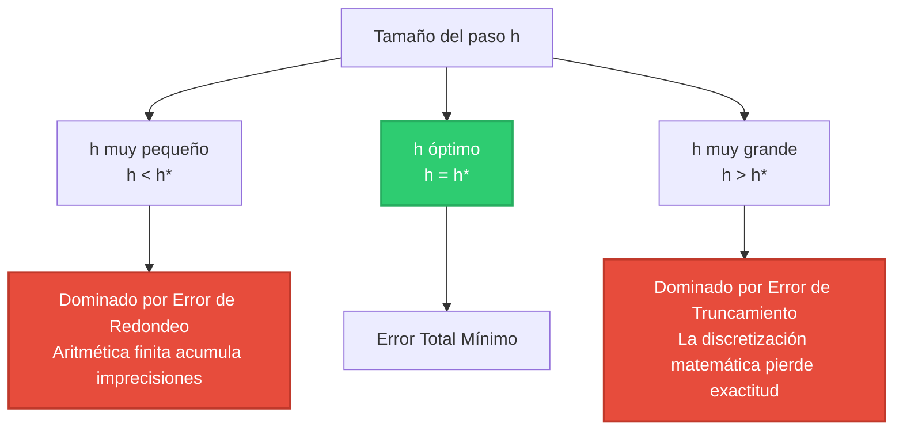

# Capítulo 3: Aproximaciones y Errores de Redondeo

## Clasificación general de los errores numéricos

En el modelado y simulación numérica de procesos de ingeniería, la solución calculada difiere de la solución física real debido a la superposición de diversos factores:

| Categoría de Error | Origen Principal | ¿Es Controlable por el Programador? |
| :--- | :--- | :---: |
| **Error de Truncamiento** | Se introduce al reemplazar un proceso matemático infinito (como una serie o límite) por una aproximación finita (ej. serie truncada, diferencias finitas). | **Sí** (usando más términos o reduciendo el paso de discretización $h$). |
| **Error de Redondeo** | Deriva de la imposibilidad de representar números reales continuos en un sistema digital con número finito de bits de precisión (IEEE 754). | **Parcialmente** (optimizando el orden de operaciones o usando doble precisión). |
| **Error de Modelo** | Proviene de las hipótesis simplificadoras al formular las ecuaciones físicas (ej. ignorar la fricción, suponer densidad constante). | **Sí** (sofisticando el modelo rector). |
| **Error de Datos** | Incertidumbres e imprecisiones asociadas a los instrumentos de medición con los que se obtienen los parámetros físicos. | **No** (depende de la calidad física del experimento). |

---

## Formulación matemática de los errores

### Error Verdadero Absoluto ($E_t$)
Representa la diferencia cuantitativa exacta entre el valor real y su aproximación:

$$
E_t = x - \hat{x}
$$

donde $x$ es el **valor verdadero** (generalmente analítico) y $\hat{x}$ es el **valor aproximado** obtenido por el método numérico.

### Error Relativo Porcentual Verdadero ($\varepsilon_t$)
Dado que la magnitud física del error absoluto no indica la calidad de la precisión si no se compara con la escala del problema, se define la métrica adimensional:

$$
\varepsilon_t = \frac{x - \hat{x}}{x} \times 100\% = \frac{E_t}{x} \times 100\% \quad (x \neq 0)
$$

### Error Relativo Porcentual Aproximado ($\varepsilon_a$)
En problemas de ingeniería reales, el valor verdadero $x$ es desconocido. Por lo tanto, el error se estima comparando la aproximación actual con la aproximación obtenida en el paso iterativo previo:

$$
\varepsilon_a = \left| \frac{x_r^{i+1} - x_r^i}{x_r^{i+1}} \right| \times 100\%
$$

donde:
- $x_r^{i+1}$ es la aproximación numérica en la iteración actual ($i+1$).
- $x_r^i$ es la aproximación numérica en la iteración anterior ($i$).

---

## Criterio de Tolerancia de Scarborough
El matemático J. B. Scarborough demostró que si se cumple que el error aproximado estimado es menor que una tolerancia crítica $\varepsilon_s$:

$$
\varepsilon_a < \varepsilon_s = (0.5 \times 10^{2-n})\%
$$

entonces se garantiza con total rigor que el resultado aproximado es **correcto hasta $n$ cifras significativas**.

| Cifras Significativas ($n$) | Tolerancia de Scarborough ($\varepsilon_s$) | Formato Científico Sugerido |
| :---: | :---: | :--- |
| 1 | $5.0\%$ | $\approx a \times 10^k$ |
| 2 | $0.5\%$ | $\approx a.b \times 10^k$ |
| 3 | $0.05\%$ | $\approx a.bc \times 10^k$ |
| 4 | $0.005\%$ | $\approx a.bcd \times 10^k$ |
| 5 | $0.0005\%$ | $\approx a.bcde \times 10^k$ |

---

## Estabilidad y propagación de errores en operaciones básicas

### Suma de series (Alineamiento de mantisas)
Para calcular numéricamente la serie armónica truncada:
$$
S_n = \sum_{k=1}^n \frac{1}{k}
$$

El cálculo en hardware es significativamente más preciso si se realiza en sentido descendente (de los valores de menor a mayor magnitud):

$$
S_{\text{descendente}} = \sum_{k=n}^{1} \frac{1}{k} \quad \text{es numéricamente superior a} \quad S_{\text{ascendente}} = \sum_{k=1}^{n} \frac{1}{k}
$$

**Fundamento:** Al sumar acumulativamente de $k=n$ hacia $1$, la suma parcial crece de forma suave y lenta, permitiendo que los términos infinitesimales se sumen de forma efectiva conservando sus mantisas. Por el contrario, si sumamos de $1$ a $n$, la suma crece tan rápido que para un $n$ grande, el término $1/n$ tiene una magnitud tan pequeña respecto a la suma parcial que es truncado a cero durante el alineamiento de exponentes en la ALU.

### Cancelación Catastrófica en Expresiones Trigonométricas
Consideremos la función:
$$
f(x) = 1 - \cos x \quad \text{para } x \approx 0
$$

La evaluación directa en hardware de doble precisión experimenta una pérdida masiva de cifras significativas debido a que $\cos x \approx 1$. 

Para evitar esto, aplicamos identidades trigonométricas para reformular el problema analíticamente de forma numéricamente estable:

$$
1 - \cos x = 2 \sin^2\left(\frac{x}{2}\right)
$$

Esta última fórmula no sufre de resta de casi-iguales y se comporta de manera óptima para valores de $x$ arbitrariamente pequeños.

---

## Balance del Error Total: Redondeo vs. Truncamiento

El error numérico total de una simulación es la suma combinada de los errores de truncamiento y redondeo:

$$
E_{\text{total}} = E_{\text{truncamiento}} + E_{\text{redondeo}}
$$

Al reducir el tamaño de paso discretizado $h$ (o aumentar la complejidad del modelo), el error de truncamiento decrece. Sin embargo, esto requiere un número sustancialmente mayor de operaciones aritméticas en el hardware, lo cual incrementa el error acumulado de redondeo.

El tamaño de paso óptimo $h^*$ que minimiza el error total está dado analíticamente por:

$$
h^* = \left( \frac{c_2 \varepsilon_{\text{mach}}}{c_1} \right)^{\frac{1}{p+1}}
$$

donde $p$ es el orden de convergencia teórica del método y $\varepsilon_{\text{mach}}$ es la precisión del sistema.

:::note Implicación Práctica
Reducir $h$ sistemáticamente por debajo de $h^*$ **degrada** la precisión de la solución física en lugar de mejorarla. Por ejemplo, en diferenciación numérica ordinaria con `float64`, la cota empírica típica se encuentra en $h^* \approx 10^{-8}$.
:::

---

## Sensibilidad y Condicionamiento en Álgebra Lineal

En sistemas de ecuaciones de la forma $\mathbf{A}\mathbf{x} = \mathbf{b}$, el **número de condición** de la matriz $\mathbf{A}$, denotado como $\kappa(\mathbf{A})$, mide la sensibilidad de la solución $\mathbf{x}$ ante perturbaciones o errores en los datos de entrada:

$$
\kappa(\mathbf{A}) = \|\mathbf{A}\| \cdot \|\mathbf{A}^{-1}\|
$$

donde $\|\cdot\|$ representa una norma matricial consistente (como la norma espectral o la norma 1).

- **Bien condicionado ($\kappa(\mathbf{A}) \approx 1$):** Pequeñas imprecisiones en los datos de entrada o el redondeo computacional producen cambios minúsculos en la solución final.
- **Mal condicionado ($\kappa(\mathbf{A}) \gg 1$):** Pequeñísimas perturbaciones en $\mathbf{A}$ o $\mathbf{b}$ (incluso del orden de $\varepsilon_{\text{mach}}$) producen fluctuaciones masivas y catastróficas en la solución calculada $\mathbf{x}$.

:::warning
Si una matriz está mal condicionada, ningún solucionador lineal, sin importar el orden del método, logrará salvar los resultados de ser gobernados por el ruido numérico. En sistemas reales, siempre debe monitorearse y reportarse el número de condición $\kappa(\mathbf{A})$ antes de validar los resultados de ingeniería.
:::
