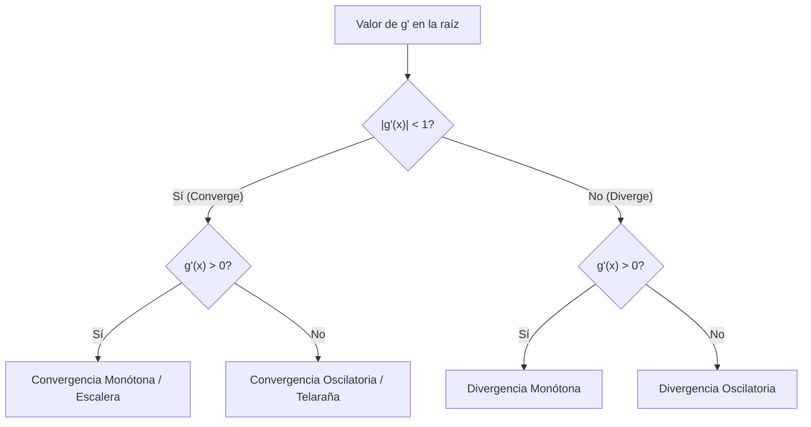

import OpenMethodsSim from '@site/src/components/simulations/OpenMethodsSim';

# Método de Punto Fijo (Iteración de Punto Fijo)

## 1. Fundamento Matemático

El método de **Punto Fijo** (también conocido como iteración de punto fijo o de un solo punto) es un método abierto que consiste en reformular la ecuación original $f(x) = 0$ para despejar la variable $x$ de manera que quede expresada como:

$$
x = g(x)
$$

Un **punto fijo** de una función $g(x)$ es un valor $x^*$ tal que:

$$
x^* = g(x^*)
$$

Geométricamente, el punto fijo representa la intersección de la curva $y = g(x)$ con la recta identidad $y = x$.

### Proceso Iterativo
Dada una estimación inicial $x_0$, la siguiente aproximación se calcula sustituyendo el valor anterior en $g(x)$:

$$
x_{i+1} = g(x_i), \quad \text{para } i = 0, 1, 2, \ldots
$$

---

## 2. Teorema y Criterio de Convergencia

No todas las formulaciones de $x = g(x)$ convergen a la raíz. Para que el método converja, se debe cumplir el teorema de convergencia de punto fijo:

:::important Teorema de Convergencia (Teorema del Punto Fijo de Banach)
Si $g(x)$ y $g'(x)$ son continuas en un intervalo abierto alrededor del punto fijo $x^*$, y se cumple que:

$$
|g'(x)| < 1 \quad \forall x \in [a, b]
$$

entonces la iteración $x_{i+1} = g(x_i)$ **convergerá** a la raíz única $x^*$ para cualquier valor inicial $x_0 \in [a, b]$.
:::

### Velocidad de Convergencia
La convergencia de este método es **lineal**. La tasa de reducción del error de una iteración a otra viene dada por la magnitud de la derivada:

$$
E_{i+1} \approx g'(x^*) E_i
$$

Donde $E_i = |x_i - x^*|$ es el error absoluto verdadero.
- Si $|g'(x^*)| \approx 0$, la convergencia será extremadamente rápida.
- Si $|g'(x^*)| \approx 1$, la convergencia será muy lenta.
- Si $|g'(x^*)| > 1$, la secuencia **divergirá** (se alejará de la raíz).

---

## 3. Comportamiento Gráfico: Diagramas de Telaraña

El comportamiento dinámico de la iteración de punto fijo puede clasificarse en cuatro tipos según el valor de la pendiente de $g(x)$ (es decir, $g'(x)$) en la vecindad de la raíz:

| Pendiente de $g(x)$ | Comportamiento | Patrón Gráfico |
| :--- | :--- | :--- |
| **$0 < g'(x) < 1$** | Convergencia Monótona | Escalera convergente |
| **$-1 < g'(x) < 0$** | Convergencia Oscilatoria | Espiral/Telaraña convergente |
| **$g'(x) > 1$** | Divergencia Monótona | Escalera divergente |
| **$g'(x) < -1$** | Divergencia Oscilatoria | Espiral/Telaraña divergente |



---

## 4. Implementación en Python (Calidad de Producción)

A continuación se presenta un código robusto con anotaciones de tipo, manejo de excepciones y detección temprana de divergencias.

```python
import math
from typing import Callable, Tuple, List, Optional

def punto_fijo(
    g: Callable[[float], float],
    x0: float,
    es: float = 0.0001,
    imax: int = 100,
    check_divergence: bool = True
) -> Tuple[float, List[dict]]:
    """
    Encuentra la raíz de x = g(x) utilizando la iteración de Punto Fijo.

    Parámetros:
    -----------
    g                : Función de iteración despejada.
    x0               : Estimación inicial de la raíz.
    es               : Tolerancia del error aproximado porcentual (%) (default: 0.0001%).
    imax             : Número máximo de iteraciones permitidas (default: 100).
    check_divergence : Si es True, detiene la ejecución si el error crece.

    Retorna:
    --------
    Tuple[float, List[dict]]:
        - Raíz aproximada.
        - Historial detallado de cada iteración (para tabulación o graficación).
    """
    x = x0
    historial = []
    
    for i in range(imax):
        try:
            x_nuevo = g(x)
        except Exception as err:
            raise ValueError(f"Error al evaluar g(x) en x={x}: {err}")
            
        # Calcular error aproximado relativo porcentual
        ea = 100.0
        if x_nuevo != 0:
            ea = abs((x_nuevo - x) / x_nuevo) * 100
            
        # Almacenar registro
        registro = {
            "iter": i + 1,
            "x_i": x,
            "x_nuevo": x_nuevo,
            "ea": ea if i > 0 else float('nan')
        }
        historial.append(registro)
        
        # Verificar criterio de divergencia prematura
        if check_divergence and i > 1:
            error_anterior = historial[-2]["ea"]
            # Si el error relativo crece sustancialmente de manera repetida, detenemos
            if ea > error_anterior * 1.5:
                raise RuntimeError(
                    f"Divergencia detectada. El error aproximado aumentó de "
                    f"{error_anterior:.4f}% a {ea:.4f}% en la iteración {i+1}."
                )

        if i > 0 and ea < es:
            return x_nuevo, historial
            
        x = x_nuevo
        
    return x, historial
```

---

## 5. Ejemplo Analítico Resuelto

**Problema**: Encontrar una raíz real de $f(x) = e^{-x} - x = 0$ usando la estimación inicial $x_0 = 0$.

### Despejes Posibles
1. **Opción A (Convergente)**: Despejando la $x$ directa:
   $$x = e^{-x} \implies g_1(x) = e^{-x}$$
   Analizando la derivada en la vecindad de la raíz ($x^* \approx 0.5671$):
   $$g_1'(x) = -e^{-x} \implies |g_1'(0.5671)| = |-0.5671| \approx 0.5671 < 1 \implies \text{Converge}$$

2. **Opción B (Divergente)**: Despejando $x$ vía logaritmo:
   $$e^{-x} = x \implies -x = \ln(x) \implies x = -\ln(x) \implies g_2(x) = -\ln(x)$$
   Analizando la derivada:
   $$g_2'(x) = -\frac{1}{x} \implies |g_2'(0.5671)| \approx \frac{1}{0.5671} \approx 1.763 > 1 \implies \text{Diverge}$$

### Ejecución Tabulada (Opción A: $g(x) = e^{-x}$)

| Iteración ($i$) | $x_i$ | $x_{i+1} = e^{-x_i}$ | $\varepsilon_a$ (%) | Comentario |
| :---: | :---: | :---: | :---: | :--- |
| **0** | 0.000000 | 1.000000 | — | Estimación inicial |
| **1** | 1.000000 | 0.367879 | 171.82 | Oscila hacia abajo |
| **2** | 0.367879 | 0.692201 | 46.85 | Oscila hacia arriba |
| **3** | 0.692201 | 0.500473 | 38.31 | Comportamiento en espiral |
| **4** | 0.500473 | 0.606244 | 17.45 | Reducción progresiva |
| **5** | 0.606244 | 0.545396 | 11.16 | Convergiendo al punto fijo |
| **6** | 0.545396 | 0.579612 | 5.90 | |
| **7** | 0.579612 | 0.560115 | 3.48 | |
| **8** | 0.560115 | 0.571143 | 1.93 | |
| **9** | 0.571143 | 0.564879 | 1.11 | |
| **10** | 0.564879 | 0.568429 | 0.62 | Criterio $\varepsilon_s < 1\%$ cumplido. |

:::tip Nota sobre la oscilación
En este caso, $g'(x) = -e^{-x} < 0$. Como la derivada es negativa, el error cambia de signo alternadamente, lo que genera una **convergencia oscilatoria** (espiral en el plano geométrico).
:::

---

## 🎮 Simulación Interactiva

Prueba la iteración de Punto Fijo en tiempo real. Define tu propia función de iteración $g(x)$ (donde $x = g(x)$), ingresa la estimación inicial $x_0$, y observa cómo se traza dinámicamente el **diagrama de telaraña** en la gráfica interactiva.

<OpenMethodsSim defaultMethod="punto-fijo" defaultExpr="exp(-x)" defaultX0="0" />
