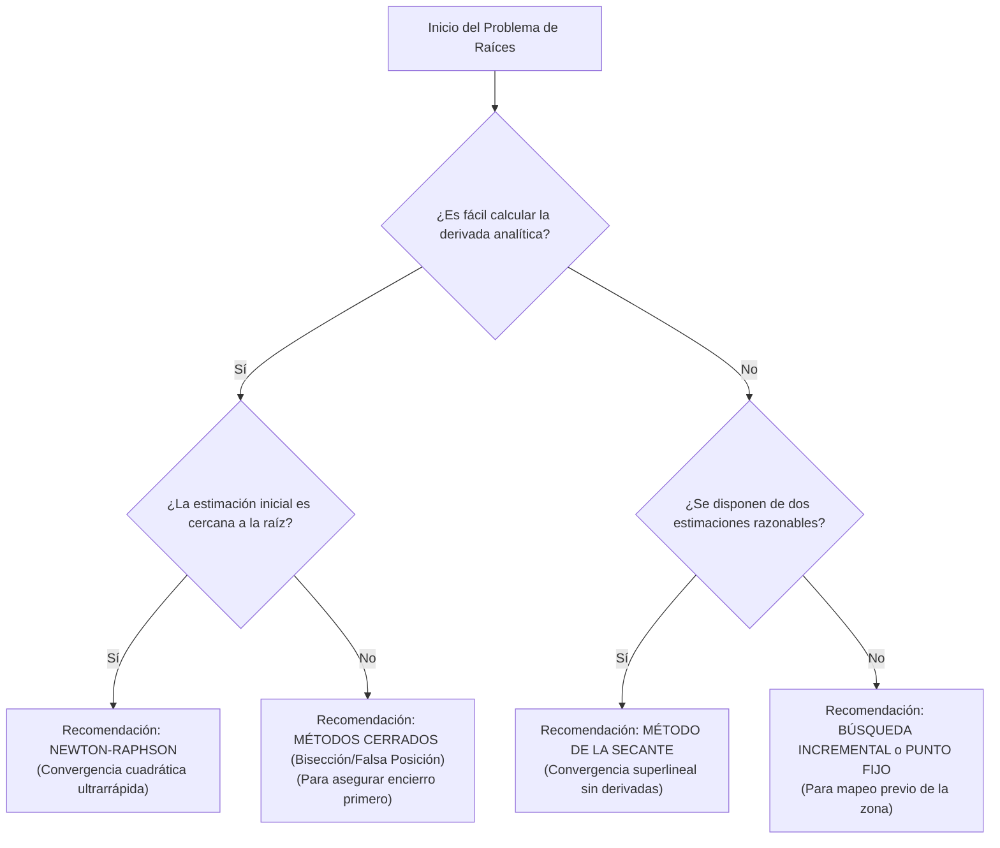

import OpenMethodsSim from '@site/src/components/simulations/OpenMethodsSim';

# Comparativa de Métodos Abiertos y Criterios de Selección

Los métodos abiertos ofrecen una velocidad de convergencia significativamente superior a la de los métodos cerrados, pero introducen el riesgo de divergencia si la estimación inicial no es adecuada. En este subcapítulo analizamos detalladamente las fortalezas, debilidades y criterios de selección para cada método abierto.

---

## 1. Tabla Comparativa de Propiedades

| Característica | Punto Fijo | Newton-Raphson | la Secante |
| :--- | :---: | :---: | :---: |
| **Estimaciones Iniciales** | 1 ($x_0$) | 1 ($x_0$) | 2 ($x_0, x_1$) |
| **Orden de Convergencia ($r$)** | **1.0** (Lineal) | **2.0** (Cuadrático) | **1.618** (Superlineal) |
| **Evaluaciones por Paso ($N$)** | 1 ($g(x_i)$) | 2 ($f(x_i), f'(x_i)$) | 1 ($f(x_i)$) |
| **Garantía de Convergencia** | No (Requiere $|g'(x)| < 1$) | No (Requiere $f'(x) \neq 0$ y cercanía) | No (Requiere $f(x_i) \neq f(x_{i-1})$) |
| **Requiere Derivada** | No (solo despeje algebraico) | Sí ($f'(x)$ analítica) | No (aproximación numérica) |
| **Complejidad de Uso** | Media (el despeje requiere pericia) | Alta (obtener e implementar $f'(x)$) | Baja (solo requiere la función original) |
| **Estabilidad** | Sensible al despeje de $g(x)$ | Inestable ante máximos/mínimos locales | Sensible a fluctuaciones y pendientes nulas |

---

## 2. Diagrama de Flujo de Decisiones

El siguiente diagrama en Mermaid muestra cómo seleccionar el método adecuado según los requisitos del problema matemático y computacional:



---

## 3. Código Python de Simulación Comparativa en Tiempo Real

El siguiente programa compara el rendimiento de los tres métodos abiertos resolviendo la ecuación:

$$
f(x) = \ln(x) + x^2 - 4 = 0
$$

La raíz verdadera de esta ecuación es $x^* \approx 1.796322$. 

```python
import math
from typing import Callable, Tuple

# --- Implementación abreviada de los tres métodos para comparación ---

def run_punto_fijo(g: Callable[[float], float], x0: float, es: float = 1e-6, imax: int = 50) -> int:
    x = x0
    for i in range(imax):
        x_new = g(x)
        ea = abs((x_new - x) / x_new) * 100 if x_new != 0 else 100
        if ea < es:
            return i + 1
        x = x_new
    return imax

def run_newton_raphson(f: Callable[[float], float], df: Callable[[float], float], x0: float, es: float = 1e-6, imax: int = 50) -> int:
    x = x0
    for i in range(imax):
        dfx = df(x)
        if abs(dfx) < 1e-12:
            return imax
        x_new = x - f(x) / dfx
        ea = abs((x_new - x) / x_new) * 100 if x_new != 0 else 100
        if ea < es:
            return i + 1
        x = x_new
    return imax

def run_secante(f: Callable[[float], float], x0: float, x1: float, es: float = 1e-6, imax: int = 50) -> int:
    x_prev, x_curr = x0, x1
    f_prev, f_curr = f(x_prev), f(x_curr)
    for i in range(imax):
        diff_f = f_curr - f_prev
        if abs(diff_f) < 1e-12:
            return imax
        x_next = x_curr - (f_curr * (x_curr - x_prev)) / diff_f
        ea = abs((x_next - x_curr) / x_next) * 100 if x_next != 0 else 100
        if ea < es:
            return i + 1
        x_prev, x_curr = x_curr, x_next
        f_prev, f_curr = f_curr, f(x_next)
    return imax

# --- Configuración de la ecuación f(x) = ln(x) + x^2 - 4 = 0 ---
f = lambda x: math.log(x) + x**2 - 4
df = lambda x: 1/x + 2*x
# Despeje g(x) para punto fijo: x = sqrt(4 - ln(x))
g = lambda x: math.sqrt(4 - math.log(x))

# --- Ejecución Comparativa ---
tol = 0.00001  # 10^-5 %
x_start = 1.5
x_start_sec = 2.0  # Segundo punto para la secante

iter_pf = run_punto_fijo(g, x_start, tol)
iter_nr = run_newton_raphson(f, df, x_start, tol)
iter_sec = run_secante(f, x_start, x_start_sec, tol)

print(f"Resultados de comparación (Ecuación: ln(x) + x^2 - 4 = 0, Tol: {tol}%):")
print(f"  - Punto Fijo     : {iter_pf} iteraciones (g(x) = sqrt(4 - ln(x)))")
print(f"  - Newton-Raphson : {iter_nr} iteraciones")
print(f"  - la Secante     : {iter_sec} iteraciones")
```

---

## 4. Criterios Prácticos de Selección

1. **Usa Newton-Raphson** cuando:
   - Se dispone de una expresión analítica de la derivada $f'(x)$ y es fácil de programar.
   - Es crítico minimizar el número de pasos de iteración.
   - El punto de partida está firmemente validado mediante una gráfica.
2. **Usa la Secante** cuando:
   - Calcular la derivada de la función es extremadamente difícil, imposible analíticamente, o consume mucha CPU.
   - Ya se disponen de dos puntos razonables de partida.
   - Se desea mantener un desempeño rápido y superlineal sin la sobrecarga de la derivada.
3. **Usa Punto Fijo** cuando:
   - Se requiere un análisis conceptual de la dinámica de sistemas caóticos (diagramas de telaraña).
   - Se puede estructurar un despeje $x = g(x)$ autoconvergente garantizado por la derivada $|g'(x)| < 1$.
   - Como método de transición teórica hacia algoritmos más especializados.
4. **Combina con Métodos Cerrados**:
   - En sistemas reales industriales, la mejor práctica consiste en **hibridar**: comenzar con unas pocas iteraciones de **bisección** para estrechar la vecindad de la raíz de forma segura, y una vez que la región de búsqueda sea pequeña, cambiar a **Newton-Raphson** para una convergencia final explosivamente rápida.

---

## 🎮 Laboratorio Comparativo de Métodos Abiertos

Compara e interactúa con los tres métodos abiertos (**Punto Fijo, Newton-Raphson y la Secante**) en tiempo real. Configura las ecuaciones y los puntos iniciales para observar cómo difieren sus trayectorias geométricas (telarañas, tangentes y secantes) y analiza la velocidad de convergencia o el riesgo de divergencia de cada algoritmo.

<OpenMethodsSim defaultMethod="newton-raphson" defaultExpr="exp(-x) - x" defaultX0="0" />
